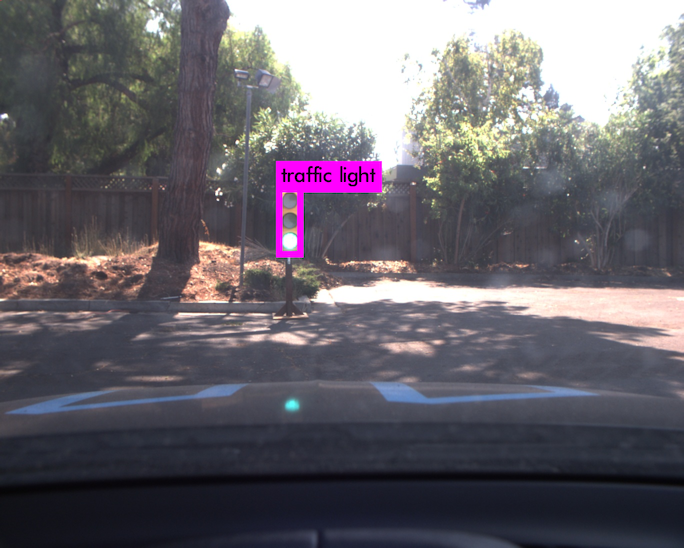

#### Tensorflow Object Detection API

[Tensorflow Object Detection API](https://github.com/tensorflow/models/tree/master/research/object_detection)

[Tensorflow detection model zoo](https://github.com/tensorflow/models/blob/master/research/object_detection/g3doc/detection_model_zoo.md)

Papers:

[SSD: Single Shot MultiBox Detector](https://arxiv.org/abs/1512.02325)

[Faster R-CNN: Towards Real-Time Object Detection with Region Proposal Networks](https://arxiv.org/abs/1506.01497)

##### SSD w/Inception Training

1. Draw bounding boxes and annotate via [RectLabel](https://rectlabel.com/). The annotations will be in [PASCAL VOC](http://host.robots.ox.ac.uk/pascal/VOC/) format.
2. Create TFrecords from images and annotations using create_tl_tf_record.py script in this repo. This will generate tl_train.record (training record with 70% data) and tl_val.record (validation record with 30% data).
3. Configure Tensorflow Object Detection API as described [here](https://github.com/tensorflow/models/blob/master/object_detection/g3doc/installation.md).
4. Grab ssd_inception_v2_tl.config from this repo.
5. Train the model:

```
python object_detection/train.py --logtostderr --pipeline_config_path=./ssd_inception_v2_tl.config --train_dir=./tl_output
```

##### SSD w/Inception Inference

- [Jupyter Notebook for simulator images](SSD_Inception/tl_detection_classification_sim.ipynb)
- [Jupyter Notebook for real world images](SSD_Inception/tl_detection_classification.ipynb)

Inference time on Tesla M60 GPU: ~32ms

##### Other Models

Faster R-CNN with Resnet-101, highly accurate bounding boxes, inference time on Tesla M60 GPU: ~330ms

SSD MobileNet v1, poorer fits on bounding boxes, inference time on Tesla M60 GPU: ~20ms

#### YOLO

[YOLO: Real-Time Object Detection](https://pjreddie.com/darknet/yolo/)
 
Papers:

[You Only Look Once: Unified, Real-Time Object Detection](https://arxiv.org/abs/1506.02640)

[YOLO9000: Better, Faster, Stronger](https://arxiv.org/abs/1612.08242)

##### YOLO Training

1. Clone modified [Darknet](https://github.com/AlexeyAB/darknet)
2. Draw bounding boxes using [YOLO mark](https://github.com/AlexeyAB/Yolo_mark) (annotations formatted for YOLO)
3. Place yolo-obj.cfg, obj.data, obj.names, and train.txt from this repo into darkent data folder. Update train.txt with training image paths.
4. Download pre-trained weights for conv layers - [darknet19_448.conv.23](http://pjreddie.com/media/files/darknet19_448.conv.23)
5. Train YOLO

```
./darknet detector train data/obj.data yolo-obj.cfg darknet19_448.conv.23
```

See [here](https://github.com/AlexeyAB/darknet#how-to-train-to-detect-your-custom-objects) for additional details.

##### YOLO Inference via Darknet

Run on a single image. Inference time on Tesla M60 GPU: ~27ms

```
ubuntu@ip-172-31-8-216:~/darknet$ ./darknet detector test data/obj.data yolo-obj.cfg yolo-obj_2000.weights left0315.jpg
layer     filters    size              input                output
    0 conv     32  3 x 3 / 1   416 x 416 x   3   ->   416 x 416 x  32
    1 max          2 x 2 / 2   416 x 416 x  32   ->   208 x 208 x  32
    2 conv     64  3 x 3 / 1   208 x 208 x  32   ->   208 x 208 x  64
    3 max          2 x 2 / 2   208 x 208 x  64   ->   104 x 104 x  64
    4 conv    128  3 x 3 / 1   104 x 104 x  64   ->   104 x 104 x 128
    5 conv     64  1 x 1 / 1   104 x 104 x 128   ->   104 x 104 x  64
    6 conv    128  3 x 3 / 1   104 x 104 x  64   ->   104 x 104 x 128
    7 max          2 x 2 / 2   104 x 104 x 128   ->    52 x  52 x 128
    8 conv    256  3 x 3 / 1    52 x  52 x 128   ->    52 x  52 x 256
    9 conv    128  1 x 1 / 1    52 x  52 x 256   ->    52 x  52 x 128
   10 conv    256  3 x 3 / 1    52 x  52 x 128   ->    52 x  52 x 256
   11 max          2 x 2 / 2    52 x  52 x 256   ->    26 x  26 x 256
   12 conv    512  3 x 3 / 1    26 x  26 x 256   ->    26 x  26 x 512
   13 conv    256  1 x 1 / 1    26 x  26 x 512   ->    26 x  26 x 256
   14 conv    512  3 x 3 / 1    26 x  26 x 256   ->    26 x  26 x 512
   15 conv    256  1 x 1 / 1    26 x  26 x 512   ->    26 x  26 x 256
   16 conv    512  3 x 3 / 1    26 x  26 x 256   ->    26 x  26 x 512
   17 max          2 x 2 / 2    26 x  26 x 512   ->    13 x  13 x 512
   18 conv   1024  3 x 3 / 1    13 x  13 x 512   ->    13 x  13 x1024
   19 conv    512  1 x 1 / 1    13 x  13 x1024   ->    13 x  13 x 512
   20 conv   1024  3 x 3 / 1    13 x  13 x 512   ->    13 x  13 x1024
   21 conv    512  1 x 1 / 1    13 x  13 x1024   ->    13 x  13 x 512
   22 conv   1024  3 x 3 / 1    13 x  13 x 512   ->    13 x  13 x1024
   23 conv   1024  3 x 3 / 1    13 x  13 x1024   ->    13 x  13 x1024
   24 conv   1024  3 x 3 / 1    13 x  13 x1024   ->    13 x  13 x1024
   25 route  16
   26 reorg              / 2    26 x  26 x 512   ->    13 x  13 x2048
   27 route  26 24
   28 conv   1024  3 x 3 / 1    13 x  13 x3072   ->    13 x  13 x1024
   29 conv     30  1 x 1 / 1    13 x  13 x1024   ->    13 x  13 x  30
   30 detection
Loading weights from yolo-obj_2000.weights...Done!
left0315.jpg: Predicted in 0.026677 seconds.
traffic light: 90%
Not compiled with OpenCV, saving to predictions.png instead
```





##### YOLO Inference via Darkflow

1. Clone [Darkflow](https://github.com/thtrieu/darkflow)
2. Place detect.py, labels.txt, and yolo-obj.cfg from this repo into darkflow folder
3. Download YOLO [weights](https://drive.google.com/file/d/0B_SXDGKPsMsfYmdia1lzUjlSaXM/view?usp=sharing) into darkflow folder
4. Cythonize Darkflow (python setup.py build_ext --inplace) - works with Python 2.7 or Python 3
5. Flow all images in test_images as follows (output will go to test_images/out):

```
./flow --imgdir test_images/ --model yolo-obj.cfg --load yolo-obj_2000.weights 
```

6. Run on a single image from within Python (loop 5 times to prime GPU). Inference time on Tesla M60 GPU: ~63ms

```
ubuntu@ip-172-31-8-216:~/darkflow$ python detect.py 
/home/ubuntu/darkflow/darkflow/dark/darknet.py:54: UserWarning: ./cfg/yolo-obj_2000.cfg not found, use yolo-obj.cfg instead
  cfg_path, FLAGS.model))
Parsing yolo-obj.cfg
Loading yolo-obj_2000.weights ...
Successfully identified 268242952 bytes
Finished in 0.015836477279663086s

Building net ...
Source | Train? | Layer description                | Output size
-------+--------+----------------------------------+---------------
       |        | input                            | (?, 416, 416, 3)
 Load  |  Yep!  | conv 3x3p1_1  +bnorm  leaky      | (?, 416, 416, 32)
 Load  |  Yep!  | maxp 2x2p0_2                     | (?, 208, 208, 32)
 Load  |  Yep!  | conv 3x3p1_1  +bnorm  leaky      | (?, 208, 208, 64)
 Load  |  Yep!  | maxp 2x2p0_2                     | (?, 104, 104, 64)
 Load  |  Yep!  | conv 3x3p1_1  +bnorm  leaky      | (?, 104, 104, 128)
 Load  |  Yep!  | conv 1x1p0_1  +bnorm  leaky      | (?, 104, 104, 64)
 Load  |  Yep!  | conv 3x3p1_1  +bnorm  leaky      | (?, 104, 104, 128)
 Load  |  Yep!  | maxp 2x2p0_2                     | (?, 52, 52, 128)
 Load  |  Yep!  | conv 3x3p1_1  +bnorm  leaky      | (?, 52, 52, 256)
 Load  |  Yep!  | conv 1x1p0_1  +bnorm  leaky      | (?, 52, 52, 128)
 Load  |  Yep!  | conv 3x3p1_1  +bnorm  leaky      | (?, 52, 52, 256)
 Load  |  Yep!  | maxp 2x2p0_2                     | (?, 26, 26, 256)
 Load  |  Yep!  | conv 3x3p1_1  +bnorm  leaky      | (?, 26, 26, 512)
 Load  |  Yep!  | conv 1x1p0_1  +bnorm  leaky      | (?, 26, 26, 256)
 Load  |  Yep!  | conv 3x3p1_1  +bnorm  leaky      | (?, 26, 26, 512)
 Load  |  Yep!  | conv 1x1p0_1  +bnorm  leaky      | (?, 26, 26, 256)
 Load  |  Yep!  | conv 3x3p1_1  +bnorm  leaky      | (?, 26, 26, 512)
 Load  |  Yep!  | maxp 2x2p0_2                     | (?, 13, 13, 512)
 Load  |  Yep!  | conv 3x3p1_1  +bnorm  leaky      | (?, 13, 13, 1024)
 Load  |  Yep!  | conv 1x1p0_1  +bnorm  leaky      | (?, 13, 13, 512)
 Load  |  Yep!  | conv 3x3p1_1  +bnorm  leaky      | (?, 13, 13, 1024)
 Load  |  Yep!  | conv 1x1p0_1  +bnorm  leaky      | (?, 13, 13, 512)
 Load  |  Yep!  | conv 3x3p1_1  +bnorm  leaky      | (?, 13, 13, 1024)
 Load  |  Yep!  | conv 3x3p1_1  +bnorm  leaky      | (?, 13, 13, 1024)
 Load  |  Yep!  | conv 3x3p1_1  +bnorm  leaky      | (?, 13, 13, 1024)
 Load  |  Yep!  | concat [16]                      | (?, 26, 26, 512)
 Load  |  Yep!  | local flatten 2x2                | (?, 13, 13, 2048)
 Load  |  Yep!  | concat [26, 24]                  | (?, 13, 13, 3072)
 Load  |  Yep!  | conv 3x3p1_1  +bnorm  leaky      | (?, 13, 13, 1024)
 Load  |  Yep!  | conv 1x1p0_1    linear           | (?, 13, 13, 30)
-------+--------+----------------------------------+---------------
GPU mode with 1.0 usage
2017-09-20 18:51:26.297657: I tensorflow/stream_executor/cuda/cuda_gpu_executor.cc:893] successful NUMA node read from SysFS had negative value (-1), but there must be at least one NUMA node, so returning NUMA node zero
2017-09-20 18:51:26.298012: I tensorflow/core/common_runtime/gpu/gpu_device.cc:940] Found device 0 with properties: 
name: Tesla M60
major: 5 minor: 2 memoryClockRate (GHz) 1.1775
pciBusID 0000:00:1e.0
Total memory: 7.43GiB
Free memory: 7.36GiB
2017-09-20 18:51:26.298036: I tensorflow/core/common_runtime/gpu/gpu_device.cc:961] DMA: 0 
2017-09-20 18:51:26.298046: I tensorflow/core/common_runtime/gpu/gpu_device.cc:971] 0:   Y 
2017-09-20 18:51:26.298064: I tensorflow/core/common_runtime/gpu/gpu_device.cc:1030] Creating TensorFlow device (/gpu:0) -> (device: 0, name: Tesla M60, pci bus id: 0000:00:1e.0)
2017-09-20 18:51:26.307881: E tensorflow/stream_executor/cuda/cuda_driver.cc:924] failed to allocate 7.43G (7983005696 bytes) from device: CUDA_ERROR_OUT_OF_MEMORY
2017-09-20 18:51:26.870792: I tensorflow/compiler/xla/service/platform_util.cc:58] platform CUDA present with 1 visible devices
2017-09-20 18:51:26.870826: I tensorflow/compiler/xla/service/platform_util.cc:58] platform Host present with 16 visible devices
2017-09-20 18:51:26.874851: I tensorflow/compiler/xla/service/service.cc:198] XLA service 0x545c5e0 executing computations on platform Host. Devices:
2017-09-20 18:51:26.874874: I tensorflow/compiler/xla/service/service.cc:206]   StreamExecutor device (0): <undefined>, <undefined>
2017-09-20 18:51:26.875018: I tensorflow/compiler/xla/service/platform_util.cc:58] platform CUDA present with 1 visible devices
2017-09-20 18:51:26.875034: I tensorflow/compiler/xla/service/platform_util.cc:58] platform Host present with 16 visible devices
2017-09-20 18:51:26.876541: I tensorflow/compiler/xla/service/service.cc:198] XLA service 0x535fe20 executing computations on platform CUDA. Devices:
2017-09-20 18:51:26.876557: I tensorflow/compiler/xla/service/service.cc:206]   StreamExecutor device (0): Tesla M60, Compute Capability 5.2
Finished in 8.190787076950073s

1.4682774543762207
[{'label': 'traffic light', 'confidence': 0.90037262, 'topleft': {'x': 550, 'y': 363}, 'bottomright': {'x': 605, 'y': 516}}]
0.06563544273376465
[{'label': 'traffic light', 'confidence': 0.90037262, 'topleft': {'x': 550, 'y': 363}, 'bottomright': {'x': 605, 'y': 516}}]
0.06284618377685547
[{'label': 'traffic light', 'confidence': 0.90037262, 'topleft': {'x': 550, 'y': 363}, 'bottomright': {'x': 605, 'y': 516}}]
0.06300640106201172
[{'label': 'traffic light', 'confidence': 0.90037262, 'topleft': {'x': 550, 'y': 363}, 'bottomright': {'x': 605, 'y': 516}}]
0.06336641311645508
[{'label': 'traffic light', 'confidence': 0.90037262, 'topleft': {'x': 550, 'y': 363}, 'bottomright': {'x': 605, 'y': 516}}]
```